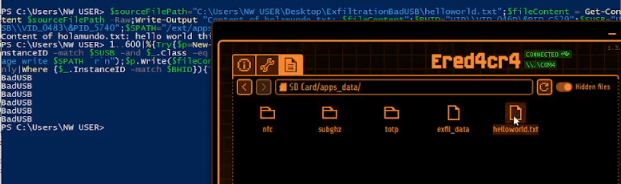

# Exfiltrate-PC2Flipper

**Exfiltrate-PC2Flipper** is a Ducky Script project designed to exfiltrate files from a Windows PC to Flipper Zero's storage. This is especially useful when the computer restricts direct USB storage connections but allows PowerShell execution. The attack uses fake VIDs and PIDs and also the transmision is through serial port communication.



### ⚠️ Disclaimer
This tool is intended for educational purposes and ethical hacking within legal boundaries. Do not use this tool on systems without explicit permission from the owner. Unauthorized use can lead to legal consequences.

## How It Works

1. **Run the BadUSB script** on the target Windows machine via the Flipper Zero.
2. The script will execute a PowerShell command to start the exfiltration process.
3. When the script indicates "BadUSB" mode in the PowerShell output, you will need to exit BadUSB mode on the Flipper to allow file copying (To do this, just press the "back" key on the flipper zero to return to the main menu).
4. Files from the Windows PC will be copied to the Flipper Zero storage.

TUTORIAL: https://www.youtube.com/watch?v=YMfVzDnLKu0

## Prerequisites

- **Flipper Zero** with BadUSB functionality enabled.
- **PowerShell** must be enabled on the target Windows machine.
- The "Num Lock/Bloq Num" key must be disabled in the keyboard.

## Usage

### 1. Modify the Script Variables
Before running the script, update the VID and PID that is allowed in your computer and finally update the following variables in the PowerShell command to match your environment:
- `$sourceFilePath`: The source path on the Windows PC for the file you want to exfiltrate.
- `$SPATH`: The destination path, which points to the Flipper Zero's storage.

Example:
```powershell
$sourceFilePath = "C:\Users\path-source......REPLACE HERE"
$SPATH = "/ext/apps_data/FILENAMEHERE"
